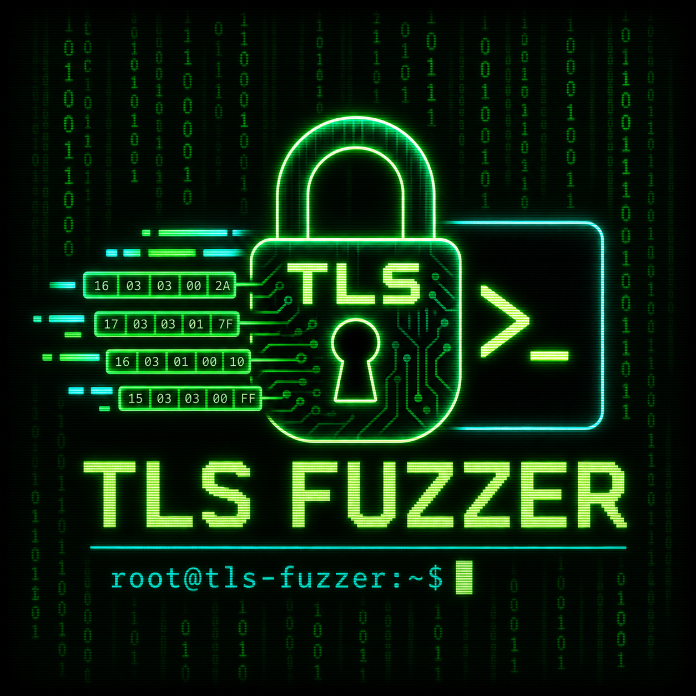
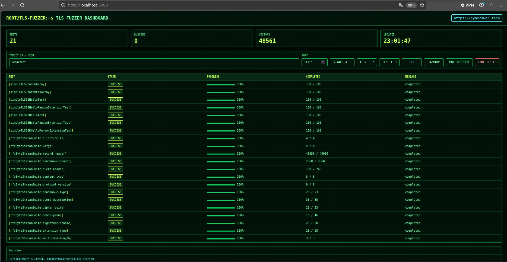
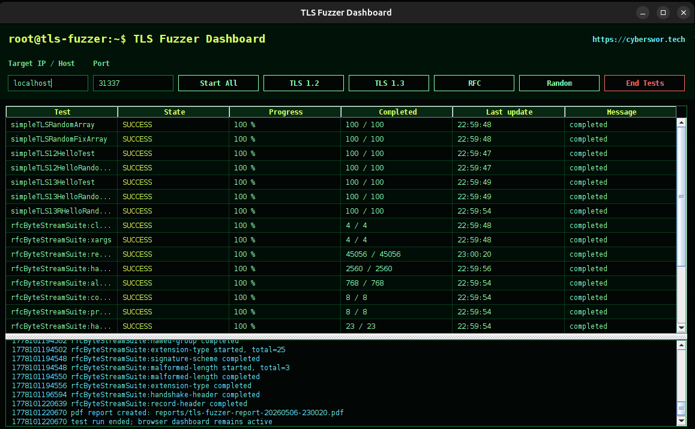
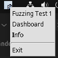

# TLS Fuzzer



`tech.cybersword.tls.fuzzer` is a Java TLS 1.2 and TLS 1.3 byte-stream fuzzer for people who like looking at protocols where they actually live: on the wire.

It generates RFC-shaped TLS records, malformed headers, length-boundary probes, random payloads, ClientHello variants, extension probes, and illustrated TLS flows, then fires them at a target and shows the run in a terminal-style browser dashboard, Swing dashboard, and system tray.

Use it only on systems you own or are explicitly allowed to test.

## Screenshots

### Browser Dashboard



The browser dashboard runs at `http://localhost:8080/` by default. It shows target input, suite buttons, live job progress, logs, RFC vector categories, and PDF report download.

### Swing Dashboard



The Java Swing UI mirrors the browser dashboard in a terminal style: target input, TLS 1.2/TLS 1.3/RFC/random suite buttons, status table, and live log view.

### System Tray



The tray menu opens the dashboard, shows project info, and exits the tool when a desktop tray is available.

### Malformed TLS Packet Example


The fuzzer includes malformed record and handshake length probes, enum-boundary values, unusual versions, and broad header selector coverage.

## Why This Exists

TLS implementations are full of interesting edge conditions: legacy record versions, compatibility mode, uint16/uint24 lengths, extension vectors, handshake state transitions, alert parsing, cipher-suite filtering, downgrade behavior, parser tolerance, and error handling paths that normal clients never touch.

This project is built for that layer. It is not a polished web scanner. It is a byte-level probe box for TLS parser behavior.

Good use cases:

- Shake a custom TLS terminator, proxy, load balancer, embedded stack, or lab server.
- Compare TLS 1.2 and TLS 1.3 parser behavior.
- Generate reproducible RFC-inspired byte streams.
- Stress malformed headers and declared-length mismatches.
- Watch long fuzzing runs in a browser or desktop dashboard.
- Produce a compact PDF report after a run.

## Current Coverage

The RFC byte-stream suite currently generates `48561` vectors split into categories:

- `client-hello`
- `xargs`
- `record-header`
- `handshake-header`
- `alert-header`
- `content-type`
- `protocol-version`
- `handshake-type`
- `alert-description`
- `cipher-suite`
- `named-group`
- `signature-scheme`
- `extension-type`
- `malformed-length`

Inputs and references:

- TLS 1.2 RFC 5246: <https://www.rfc-editor.org/rfc/rfc5246.txt>
- TLS 1.3 RFC 8446: <https://www.rfc-editor.org/rfc/rfc8446.txt>
- Illustrated TLS 1.2: <https://tls12.xargs.org/#open-all>
- Illustrated TLS 1.3: <https://tls13.xargs.org/#open-all>

The suite covers RFC-defined fields and boundary probes, including:

- TLSPlaintext record headers
- content type values and boundaries
- protocol versions including legacy and TLS 1.3 compatibility values
- uint16 record length probes
- handshake message type values
- uint24 handshake length probes
- alert level and alert description probes
- TLS 1.2 and TLS 1.3 ClientHello records
- randomized extension payloads
- cipher suites
- supported groups and key shares
- signature schemes
- extension type probes
- malformed length records

Fully enumerating every possible TLS byte stream is not practical because TLS contains variable-length opaque fields up to 2^16 and 2^24 bytes. The project focuses on high-value parser surfaces: all one-byte header selectors, RFC enum values, known compatibility fields, and length boundaries.

## Quick Start

Build and start the fuzzer:

```bash
./start.sh
```

Start a local OpenSSL TLS target first, then run the fuzzer against it:

```bash
./start.sh --with-local-server
```

Start without rebuilding:

```bash
./start.sh --skip-build
```

Open:

```text
http://localhost:8080/
```

Default target:

```text
localhost:31337
```

## Manual Build

This workspace uses Java 17 and Maven:

```bash
/home/david/progs/apache-maven-3.9.11/bin/mvn test
/home/david/progs/apache-maven-3.9.11/bin/mvn package
java -jar target/tech.cybersword.tls.fuzzer-1.0.0-SNAPSHOT.jar
```

## Configuration

Runtime configuration lives in:

```text
tech.cybersword.tls.fuzzer.properties
```

Important defaults:

- TLS target host: `localhost`
- TLS target port: `31337`
- request count for random/legacy jobs: `100`
- worker threads: `4`
- socket timeout: `100` ms
- browser dashboard: enabled
- browser dashboard port: `8080`
- browser dashboard HTTPS: disabled by default

HTTPS dashboard mode can be enabled with a Java keystore:

```properties
dashboard.browser.https.enabled=true
dashboard.browser.https.keystore=/path/to/dashboard.jks
dashboard.browser.https.keystorePassword=changeit
```

## Dashboard Controls

Both browser and Swing dashboards support:

- target host/IP input
- target port input
- `Start All`
- `TLS 1.2`
- `TLS 1.3`
- `RFC`
- `Random`
- `End Tests`
- live log view

The fuzzer starts idle. A test run begins only after one of the suite buttons is clicked.

The browser dashboard also includes:

- vector catalog at `/api/vectors`
- live status at `/api/status`
- health check at `/api/health`
- PDF report download at `/api/report`

## Reports

After a run ends, the project creates a PDF report in:

```text
reports/
```

The browser dashboard also exposes the latest report through:

```text
http://localhost:8080/api/report
```

If no completed run report exists yet, `/api/report` creates a snapshot report from the current dashboard state.

Each PDF report includes:

- target host and port
- selected suite / start mode
- start and end time
- total configured tests
- completed tests
- failed jobs
- links to RFC 5246 and RFC 8446
- job summary
- recent logs
- test conclusion

Report layout:

- `pics/TLSFuzzerLogo.png` is embedded in the header of each page.
- `https://cybersword.tech` is written in the footer of each page.
- The footer URL is clickable in PDF readers that support link annotations.
- Multi-page reports include page numbers.

Report conclusion logic is intentionally simple for now:

- If no dashboard job failed and no job is still running, the report marks the run as completed.
- If failed or interrupted jobs exist, the report marks the run as needing review.

Current limitation: the report summarizes dashboard jobs, not every individual vector response. Full per-vector evidence is a planned improvement.

## Logs

All runtime logs are written under:

```text
log/
```

This includes Java logger output and OpenSSL helper logs from `start.sh --with-local-server`.

## Project Structure

```text
src/tech/cybersword/tls/fuzzer/client/       Raw socket TLS client sender
src/tech/cybersword/tls/fuzzer/controller/   Main orchestration and suite control
src/tech/cybersword/tls/fuzzer/dashboard/    Browser dashboard, status registry, PDF reports
src/tech/cybersword/tls/fuzzer/generator/    TLS 1.2/1.3 byte-stream and RFC vector generators
src/tech/cybersword/tls/fuzzer/server/       Local server-side helpers
src/tech/cybersword/tls/fuzzer/ui/           Swing dashboard and system tray
src/tech/cybersword/tls/fuzzer/util/         Logging, random, array, string, property helpers
src/test/java/                               JUnit tests
pics/                                        README and UI images
log/                                         Runtime logs
reports/                                     Generated PDF reports
```

## Hacker Notes

The most interesting targets are rarely the happy paths. Try this against a lab terminator with debug logging enabled and watch:

- which malformed records produce alerts vs silent closes
- which TLS 1.3 compatibility fields are tolerated
- whether huge declared lengths cause slow paths
- how the target handles unknown handshake types
- how alert parsing behaves with odd levels/descriptions
- how extension order and extension type values are processed
- whether TLS 1.2 and TLS 1.3 code paths fail differently

Useful workflow:

1. Start a target with verbose TLS logs.
2. Run only `RFC` first to map parser boundaries.
3. Run `TLS 1.2` and `TLS 1.3` to compare baseline behavior.
4. Run `Random` to add noise.
5. Pull the PDF report and compare it with target-side logs.

## Improvement TODOs

Detailed ticket drafts are available in [TICKETS.md](TICKETS.md).

Near-term improvements:

- Add persistent run IDs so reports, logs, and dashboard rows belong to one execution.
- Save per-vector results with request name, category, response bytes, exception, and timing.
- Add CSV and JSON exports next to the PDF report.
- Parse TLS alert responses and show alert level/description in the dashboard and report.
- Add response classes: timeout, TCP reset, refused, close, TLS alert, malformed response, unexpected bytes.
- Add category checkboxes so RFC suites can run selected categories only.
- Add rate limits and per-suite concurrency controls for fragile or embedded targets.
- Add dashboard history for completed runs.

Code quality improvements:

- Replace `printStackTrace()` calls with structured logger output.
- Split legacy generator helpers from the newer RFC/vector generator.
- Add integration tests using a controlled local TLS server.
- Add report pagination tests with many status rows and log entries.
- Make report output directory configurable.
- Add a report preview screenshot to this README after the layout settles.

## Test

```bash
/home/david/progs/apache-maven-3.9.11/bin/mvn test
```

Last verified locally with 11 tests passing.
